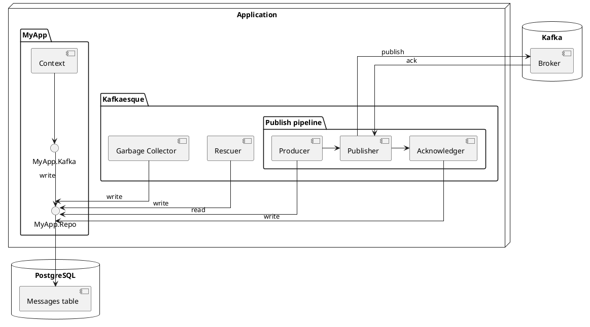

# Kafkaesque
Kafkaesque is a transactional outbox built for PostgreSQL and, primarily, Kafka.

- Transactional safety for messages: if they were created, they **will** be
eventually published. They're only created if the transaction commits
- Ordering: messages are published sequentially for topic/partition combinations
- Shutdown safety: has graceful shutdown and rescue for cases where it doesn't
happen.
- Garbage collection: outbox table is periodically cleaned

